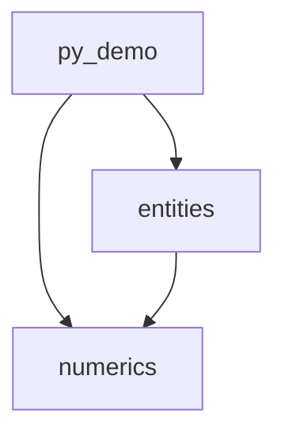

# CLAUDE.md

This file provides guidance to Claude Code (claude.ai/code) when working with code in this repository.

## Purpose of IGESio-Playground

This repository is for prototyping algorithms to be used in IGESio. IGESio is a library for reading/writing IGES files and manipulating loaded geometry, requiring various algorithms for CAD data processing. This repository consolidates the code for implementing and testing those algorithms. All prototype code is implemented in Python. Most of the file and folder structure reflects the intended module layout for the C++ implementation, though some files and folders differ in structure from the C++ counterpart.

## Tech Stack

- Python 3.13+
  - numpy -> Eigen in C++
  - scipy -> mostly custom-implemented in C++ (so only a limited set of features is used)
    - Features in use: `scipy.optimize.minimize_scalar` (bounded), `scipy.optimize.brentq`
  - geomdl -> IGESio's own NURBS implementation is used in C++ (no restriction on use here)
  - matplotlib -> not used in C++
  - pytest -> Google Test in C++

## Commands

- Install dependencies: `./py313/scripts/pip install -r requirements.txt`
- Run all tests: `./py313/scripts/pytest py_igesio/`
- Run tests for a specific module: `./py313/scripts/pytest py_igesio/numerics/`
- Run a single test file: `./py313/scripts/pytest py_igesio/numerics/tests/test_foo.py`
- Run a single test by name: `./py313/scripts/pytest py_igesio/ -k "test_name"`
- Run a script: `./py313/scripts/python <script>`
- Run demo: `./py313/scripts/python examples.py CONTAINMENT_POLY [--n_circ N] [--n_insc N] [--eps_dist FLOAT] [--save_fig BOOL]`

## Project Structure

- `docs/`: Algorithm documentation — read these before modifying complex algorithms (e.g., `containment_polygon.md` specifies the full mathematical spec for the circumscribed/inscribed polygon construction)
- `output/`: Output files (images, etc.) generated by algorithm test code
- `py_igesio/`: Python algorithm implementations and test code
  - `numerics/`: Modules for numerical computation
    - `polygons/`: Data structures and algorithms for polygons (primarily polygon approximation of closed curves)
  - `entities/`: Interfaces and implementations for each IGES entity
    - `interfaces.py`: Corresponds to `igesio/entities/interfaces/` in IGESio; defines the interfaces used on the Python side
    - `curves/`: Implementations of curve entities
  - `py_demo/`: Utility functions for demo code in Python (not ported to C++)
- `examples.py`: Demo code for each algorithm (not ported to C++; includes graph rendering and similar code)

### Key Abstractions

**`CurveBase2D`** (`entities/interfaces.py`) — Abstract base for all 2D parametric curves. Core methods: `evaluate(t)`, `derivative(t, order)`, `get_range()`, `signed_curvature(t)`. Supports corner points via `get_corner_params()`, `left_tangent()`, `right_tangent()`, `corner_exterior_angle()`.

**`PolygonData`** (`numerics/polygons.py`) — Dataclass for a polygon: `vertices` (Mx2 array), `on_curve` (bool per vertex, whether the vertex lies on the curve), `curve_params` (parameter value per on-curve vertex).

**`CurveContainmentPolygons`** (`numerics/polygons.py`) — Holds the three computed polygons for a curve: `circumscribed` (contains the curve), `inscribed` (contained within the curve), `approximate` (polygonal approximation of the curve).

**`compute_containment_polygons(curve, n_vert, ...)`** (`entities/curves/algorithms.py`) — The main public API. Takes a `CurveBase2D` and returns `CurveContainmentPolygons`.

### Test Code

- Use pytest. Place tests in a `tests/` subdirectory directly under each module.
- Do not place tests under `py_demo/`.

### Dependency Constraints (within modules)

Maintain the dependency structure shown below. If `a` depends on `b`, no module under `b` may depend on `a`. For example, polygon approximation for point-in-curve testing: the polygon class and the point-in-polygon algorithm belong in `numerics`, while the curve entity discretization algorithm belongs in `entities`.

### Implementation Notes

- Functions that will be defined in an anonymous namespace in C++ source files should be prefixed with an underscore: `_function_name`
- Files that will not be part of the public API in C++ should have their filename prefixed with an underscore: `_module_name` (placed under `src/` as both `.h` and `.cpp` when ported)
- Debug-only modules in Python should be re-imported with a leading underscore: `import xxx as _xxx`. Any code using these must be removed when porting to C++.
- Docstrings are written in Japanese.
