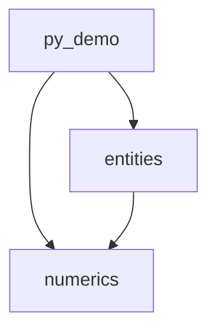

# IGESio Playground

IGESioで使用するアルゴリズムを試すためのリポジトリです。

## 概要

IGESioはIGESファイルの読み書きおよびCADジオメトリ操作を行うC++ライブラリです。このリポジトリはIGESioで使用するアルゴリズムをPythonでプロトタイピング・検証するための場所です。フォルダ構成はC++実装のモジュール構成を概ね反映しています。

## 技術スタック

- Python 3.13+
  - `numpy` (C++では Eigen)
  - `scipy` (C++ではほぼ独自実装。使用機能: `minimize_scalar` (bounded), `brentq`)
  - `geomdl` (C++ではIGESio独自のNURBS実装)
  - `matplotlib` (可視化用、C++には移植しない)
  - `pytest` (C++では Google Test)

## セットアップ

```bash
./py313/scripts/pip install -r requirements.txt
```

## コマンド

```bash
# テスト実行
./py313/scripts/pytest py_igesio/                          # 全テスト
./py313/scripts/pytest py_igesio/numerics/                 # モジュール指定
./py313/scripts/pytest py_igesio/ -k "test_name"           # テスト名指定

# スクリプト実行
./py313/scripts/python <script>

# デモ実行
./py313/scripts/python examples.py CONTAINMENT_POLY [--n_circ N] [--n_insc N] [--eps_dist FLOAT] [--save_fig BOOL]
```

## プロジェクト構成

```
igesio-playground/
├── docs/               # アルゴリズムのドキュメント
├── output/             # アルゴリズム実行で生成される画像等
├── py_igesio/          # Pythonによるアルゴリズム実装とテスト
│   ├── numerics/       # 数値計算モジュール
│   │   └── polygons/   # 多角形のデータ構造とアルゴリズム
│   ├── entities/       # IGESエンティティのインタフェースと実装
│   │   ├── interfaces.py
│   │   └── curves/     # 曲線エンティティの実装
│   └── py_demo/        # デモ用ユーティリティ (C++に移植しない)
└── examples.py         # 各アルゴリズムのデモコード
```

### モジュール依存関係



## 主要な抽象クラス・データ構造

- **`CurveBase2D`** (`entities/interfaces.py`) — 2Dパラメトリック曲線の抽象基底クラス
- **`PolygonData`** (`numerics/polygons.py`) — 多角形データクラス (`vertices`, `on_curve`, `curve_params`)
- **`CurveContainmentPolygons`** (`numerics/polygons.py`) — 曲線に対して計算された3つの多角形 (`circumscribed`, `inscribed`, `approximate`)
- **`compute_containment_polygons(curve, n_vert, ...)`** (`entities/curves/algorithms.py`) — メインのパブリックAPI
